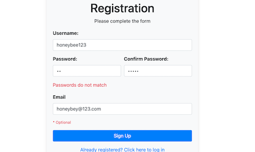

# Univ-DB: A simple Staff / Student University Portal Login System.

Univ-DB is a simple web application that simulates a university portal login system, designed to showcase my full-stack development capabilities. It provides a user-friendly platform for securely managing login credentials. The application leverages several key technologies:
It provides a user-friendly platform for securely managing login credentials. The application leverages several key technologies:

- Oracle-XE Database: Deployed as a Docker container, providing a robust and scalable database solution.
- Apache Tomcat: Used as the application server, also deployed within a Docker container for seamless integration and deployment.
- JDBC: Utilized for database connectivity, built using Maven on IntelliJ IDEA to ensure efficient development and dependency management.

Clean and Simple: No bells and whistles, no fancy js. Just a basic structure for creating a login page. This is designed as a learning tool.

## Features
- Secure Login Management: Store and hash organize login credentials for various websites.
- User Authentication: Secure user login using a backend database (MySQL) with robust password hashing.
- Front-End Interface: Intuitive user experience built with HTML, CSS, and PHP, enhanced by Bootstrap for responsiveness.

## Technologies
- Backend: MySQL (database management)
- Front-End: HTML, CSS, PHP, Bootstrap
- Server-Side Scripting: PHP

## Getting Started
Refer to the project's documentation for detailed setup instructions.

## Example Usage
Create an account, add login credentials, and manage them securely within the application.

## Note
This is a basic demonstration project. For production use, consider additional security measures.

If you enjoyed this file and found it useful, please feel free to leave a Bitcoin donation and buy us a coffee:

    
    
Support us with Bitcoin

    
<strong>BTC:<strong> bc1ql63v3wnn0wjw824m9r4peeajm7ynhzt2wqdmhc</Strong>

&copy; Ricki Angel 2024

